# Verbalist

A voice-driven to-do list iOS application that converts speech into structured tasks using Groq's LLM APIs with whisper-large-v3 for transcription. Tasks are stored in the CloudKit private database for seamless synchronization across devices.

## System Overview

### Application Flow

```mermaid
graph TD
    A[👤 User] --> B[🎤 Tap Microphone]
    B --> C[🎙️ Start Recording]
    C --> D[🗣️ User Speaks All Tasks]
    D --> E{🛑 Tap to Stop?}
    E -->|Continue| D
    E -->|Stop| F[⚡ Processing Audio]
    F --> G[🌐 Send to Groq API]
    G --> H["📝 Speech-to-Text
    whisper-large-v3"]
    H --> I["🤖 AI Task Extraction
    LLaMA-3-8B"]
    I --> J[📋 Multiple Tasks Generated]
    J --> K[☁️ Save to CloudKit]
    K --> L[✅ Tasks Appear in List]
    L --> M[📱 Sync Across Devices]
    
    style A fill:#e1f5fe
    style G fill:#fff3e0
    style K fill:#e8f5e8
    style L fill:#f3e5f5
```

### System Architecture

### Voice Processing Pipeline

### Data Flow & State Management

### Security & Encryption Flow

```mermaid
graph TD
    subgraph "Development Phase"
        A[🔑 Real Groq API Key] --> B[🔧 encrypt_api_key.swift]
        B --> C[🔐 AES-GCM Encryption]
        C --> D[📦 encrypted_api_key.dat]
    end
    
    subgraph "Runtime Decryption"
        D --> E[📱 App Launch]
        E --> F[🏢 Bundle ID + Version]
        F --> G["🔑 Key Derivation
        SHA256 Hash"]
        G --> H[🔓 AES-GCM Decrypt]
        H --> I[⚡ In-Memory Key]
        I --> J[🌐 Groq API Call]
        J --> K[🗑️ Immediate Cleanup]
    end
    
    subgraph "Security Features"
        L[🛡️ Bundle-Specific Binding]
        M[⏱️ Runtime-Only Access]
        N[🔒 No Plain Text Storage]
        O[✅ Version Control Safe]
    end
    
    style A fill:#ffcdd2
    style D fill:#c8e6c9
    style I fill:#fff9c4
    style K fill:#f8bbd9
    
    D -.-> L
    I -.-> M
    H -.-> N
    D -.-> O
```

### CloudKit Schema & Synchronization

```mermaid
graph TB
    subgraph "Local App State"
        LT["📱 Local Tasks Array
        @Published var tasks"]
        UI["🖥️ SwiftUI List View
        LazyVStack"]
    end
    
    subgraph "CloudKit Private Database"
        CR["☁️ CKRecord: Task
        - recordID: UUID
        - title: String
        - isCompleted: Int64
        - creationDate: Date"]
        IX["📊 Index: creationDate_desc
        Enables fast sorting"]
    end
    
    subgraph "Operations"
        OP1[➕ Create Task]
        OP2[✏️ Update Task]
        OP3[❌ Delete Task]
        OP4[🔄 Toggle Completion]
    end
    
    subgraph "Cross-Device Sync"
        D1[📱 iPhone]
        D2[💻 iPad]
        D3[⌚ Apple Watch]
    end
    
    LT --> UI
    
    OP1 --> CR
    OP2 --> CR
    OP3 --> CR
    OP4 --> CR
    
    CR --> IX
    CR -.->|Auto Sync| D1
    CR -.->|Auto Sync| D2
    CR -.->|Auto Sync| D3
    
    LT <-->|Optimistic Updates| CR
    
    style LT fill:#e1f5fe
    style CR fill:#e8f5e8
    style IX fill:#fff3e0
```

## Features

- **Voice Input**: Create tasks by speaking naturally
- **AI-Powered Processing**:
  - Speech-to-text conversion using Groq's whisper-large-v3 model
  - Natural language parsing with Groq LLMs
  - Automatic extraction of task details (title, notes, due dates, tags)
- **CloudKit Integration**: Private database storage with automatic syncing across devices
- **Intuitive UI**:
  - Clean task list display
  - Real-time waveform visualization during recording
  - Task preview and editing capabilities
  - Gesture-based task management

## Requirements

- iOS 16.0+
- Xcode 14.0+
- Swift 5.5+
- Apple Developer Account (for CloudKit)
- Groq API Key

## Setup

1. Clone the repository
2. Open the Xcode project
3. Set up your iCloud container identifier in the entitlements file
4. Configure your Groq API key using environment variables

### Environment Variables

The app uses the following environment variables:

- `GROQ_LLM_MODEL`: The Groq LLM model to use (default: "llama3-8b-8192")
- `GROQ_WHISPER_MODEL`: Whisper model version (default: "whisper-large-v3")

You can change AI models directly in the app through the Settings screen (gear icon), which allows selecting from:
- Different LLM models for task parsing
- Different Whisper models for transcription

No restart or code changes required!

### Available Models

**Groq LLM Models:**
- llama3-8b-8192 (default)
- llama3-70b-8192 (more powerful)

**Whisper Models:**
- whisper-large-v3

### Setting Environment Variables in Xcode

1. Edit your scheme in Xcode
2. Go to "Run" → "Arguments" → "Environment Variables"
3. Add the required variables

### Setting Up CloudKit Indexes

For optimal performance with CloudKit queries, you should set up indexes in the CloudKit Dashboard:

1. Go to [CloudKit Dashboard](https://icloud.developer.apple.com/dashboard/)
2. Select your App ID and container
3. Navigate to "Schema" → "Record Types" → "Task"
4. For each of the following fields, click the field and check "Queryable" and "Sortable":
   - `creationDate` (already indexed by default)
   - `isCompleted`
5. Click "Save Schema" to apply the changes

These indexes will significantly improve query performance when:
- Sorting tasks by creation date
- Filtering tasks by completion status

## Architecture

- **SwiftUI**: Modern declarative UI framework
- **MVVM Pattern**: Separation of concerns with ViewModels
- **CloudKit**: Apple's cloud database service
- **Async/Await**: Modern Swift concurrency for asynchronous operations

## Project Structure

- `Models/`: Data models
- `Views/`: SwiftUI view components
- `Services/`: API and persistence services
- `Utils/`: Helper utilities

## Privacy

This application:
- Requires microphone access for voice recording
- Uses CloudKit private database (data is only accessible to the user)
- Does not collect analytics
- Does not use push notifications
- Does not require user accounts

## License

[MIT License](LICENSE)

## Acknowledgements

- [Groq](https://groq.com) for whisper-large-v3 and LLM APIs
- Apple for SwiftUI and CloudKit frameworks
